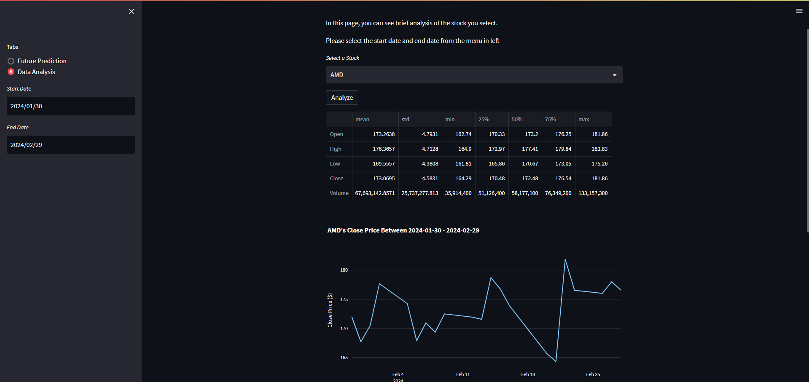

# Stock Price Prediction App
Stock price prediction app provides future price predictions for the S&P 100 Index stocks for next 90 days by using artificial intelligence models.  
It also provides comprehensive analysis about the statistics of a spesific stock in a desired time interval.

## Application Overview

### Stock Price Prediction Page (Home Page)

### Stock Analysis Page

## How to Launch The App?

### 1. Clone The Repository to Your Local
` git clone https://github.com/ozguraslank/stock-prediction-app.git `

### 2. Create a New Python environment to Avoid Conflicts (Dockerfile Will be Added Soon)
` python3 -m venv <ENV_NAME> `

### 3. Change The Environment
#### --Windows--
` .\<ENV_NAME>\Scripts\activate `

#### --Linux--
` source <ENV_NAME>/bin/activate `

### 4. Install The Required Packages Given In requirements.txt
` pip3 install -r requirements.txt ` 

### 5. Run The Web Application
` streamlit run app.py ` 

---------------------------------
After these steps, your web app will be deployed on web, both in localhost and network.  
URL for both localhost and network will be shown in the console after executing the command given in step 5.

